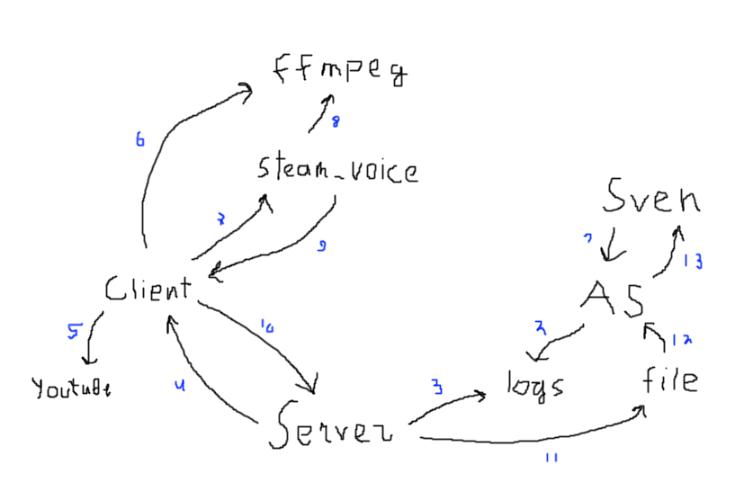

# Radio
Listen to music in Co-op.

This is complicated to set up, and it needs more config options to not be TWLZ-specific. Not recommended to use this plugin yet.

## How does it look in the game?
Use .radio in the console, select a channel, become DJ and say ~yourYoutubeUrl to start the music. Everyone on the channel will listen to your track.

There is an option for the Text-To-Speech function for chat messages. Check also .radio help.

## How does it work?

1. Player says which song to play
2. Angel script plugin writes this msg in the log file
3. Server (radio_server.py) checks this log file in the loop
4. Server says to the client about this msg
5. Client gets song from youtube
6. Client (radio_client.py) streams video into ffmpeg
7. Client notifies steam_voice about stream
8. Steam_voice streams ffmpeg into packets in the necessary format for sven plugins
9. Steam_voice sends those packets to the client
10. Client resends them to the server
11. Server writes them into the file format
12. Angel script reads them
13. Angel script plays the music and everybody is dancing, yay

## How to set up?
Check [this](how-to-set-up.md).