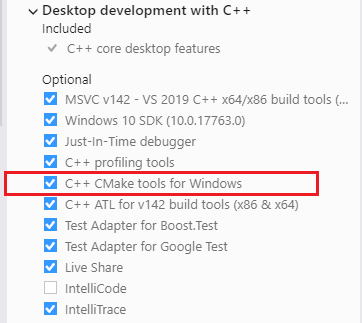
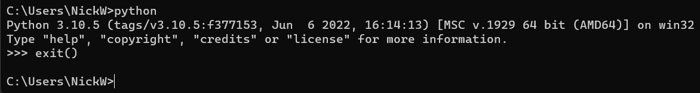
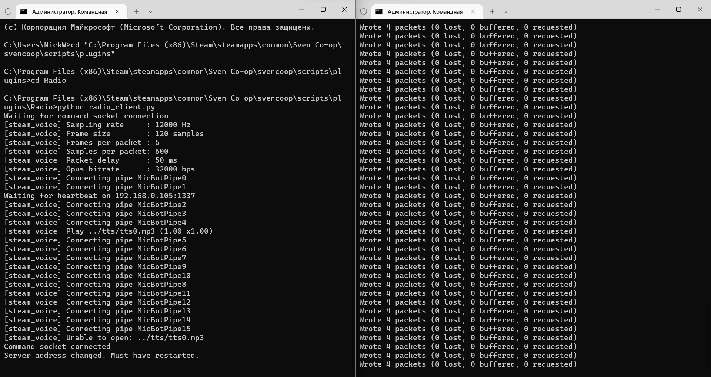
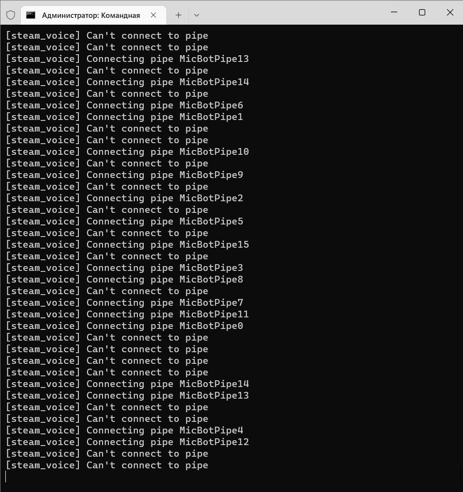

# How to set up it on windows?
1. Install git with git bash option.
    Install Visual Studio with "Desktop development with C++" workload.

     

    Install python and check it works in cmd.

    

    Install ffmpeg from [ffmpeg.org](https://ffmpeg.org/). Add ffmpeg to PATH (check [this](https://wwwarchitectryan.com/2018/03/17add-to-the-path-on-windows-10/)).

2. Open git bash, run this:
    ```
    cd "C:\Program Files (x86)\Steam\steamapps\common\Sven Co-op\svencoop\scripts\plugins"
    git clone https://github.com/wootguy/Radio/
    git clone https://github.com/wootguy/SoundCache/
    mkdir Radio/tts
    mkdir inc
    cp Radio/RelaySay.as inc/
    ```

3. Open "Radio" folder in Visual Studio -> Build -> Build All. Check the console for errors. Check "Radio" folder - folder "out" should be created.

4. Add the following to the file"C:\Program Files (x86)\Steam\steamapps\common\Sven Co-op\svencoop\default_plugins.txt":
    ```
    "plugin"
    {
    	"name" "Radio"
    	"script" "Radio/Radio"
    }   
    "plugin"
    {
    	"name" "SoundCache"
    	"script" "SoundCache/SoundCache"
    }
    ```

5. Check ipconfig for the 192.* ip address. Open the file "Radio/radio_client.py" and change the line "hostname = '. Do the same for "Radio/radio_server.py".

6. Open cmd. Do the following:
    ```
    python -m pip install pafy youtube_dl gtts yt_dlp
    ```

    After installation, do this:
    ```
    python -m pip show pafy
    ```
    Copy location and open the file "location/pafy/backend_youtube_dl.py". Remove lines in `_fetch_basic`:
    ```
    self._likes = self._ydl_info['like_count']
    self._dislikes = self._ydl_info['dislike_count']
    ```

7. Run the file "Radio/radio_server.py".
8. Run the file "Radio/radio_client.py".
   
   

9.  Run Sven Co-op server (do `map svencoop1`). Type `.radio` in the console to start the radio. That's it.

## Troubleshooting

Channel 1 is still not working, don't use it.

Sometimes after client restart you can see something like this:



Just kill `steam_voice.exe` process and restart the client.